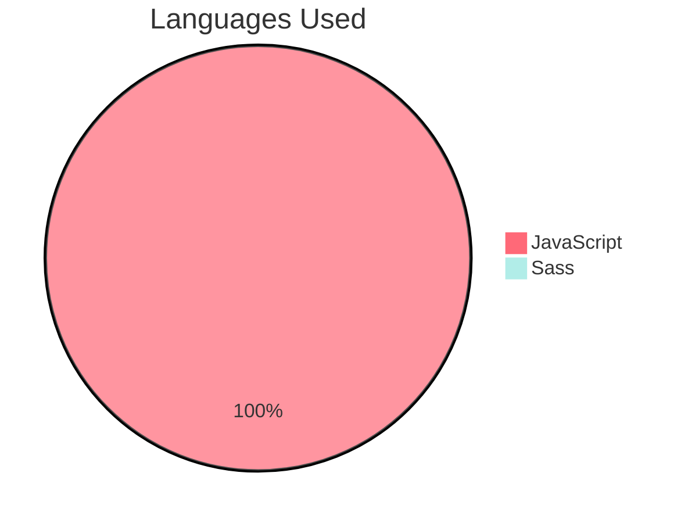

# TV SHOW Application

A web app using DOM manipulation to lists all the shows.
The user can select a specific show, can search through the shows or through the episodes of a specific show.

## Deployed Website

Access the deployed version of the application: <a href='https://adniyayoussaf-tvshow.netlify.app/'>TV SHOW</a>

## Features

- [x] The app lists all the shows.
- [x] The user can select one show.
- [x] The user can select an episode of a show.
- [x] The user can search through the shows.
- [x] The user can search through the episodes.

## Technologies Used:

- [x] JavaScript DOM Manipulation
- [x] Sass, HTML

## Pie Chart Of Languages Used

